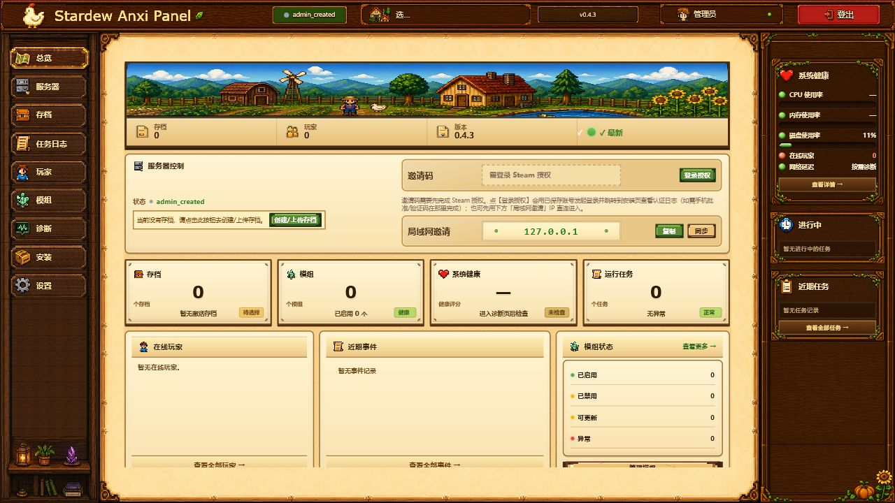

<div align="center">
  
  <h1>Stardew Anxi Panel</h1>
  <p><strong>把星露谷开服这件事，变得像打开网页一样简单。</strong></p>
  <p>面向中文用户的 Stardew Valley 专用服务器 Web 管理面板。<br>安装、Steam 认证、启停、存档、Mod、玩家与日常维护，一处完成。</p>
  <p>
    <a href="https://github.com/AnXiYiZhi/stardew-server-anxi-panel/releases/latest"></a>
    <a href="LICENSE"></a>
    <a href="#-快速开始"></a>
  </p>
  <p><a href="#-快速开始">快速开始</a> · <a href="https://anxiyizhi.github.io/stardew-server-anxi-panel/">完整文档</a> · <a href="https://anxiyizhi.github.io/stardew-server-anxi-panel/changelog">更新日志</a> · <a href="README.en.md">English</a></p>
</div>



> 上图来自 Windows 11 + WSL2 + Docker Desktop 29.5.3 中运行的正式 `v0.4.3` 镜像，展示刚完成管理员初始化、尚未安装游戏时的真实界面；不是产品原型或模拟数据。

## 🌱 这是什么

Anxi Panel 是围绕 [JunimoServer](https://stardew-valley-dedicated-server.github.io/server/) 构建的星露谷物语专服管理面板。它把原本需要在终端里完成的 Docker 部署、Steam 登录、服务器控制和文件维护，整理成一套适合服主日常使用的中文 Web 界面。

你只需要准备一台 Linux 云服务器、支持 Docker 的 NAS，或安装了 WSL2 与 Docker Desktop 的 Windows 电脑。部署面板后，在浏览器里创建管理员、安装游戏、选择农场存档，就可以把邀请码分享给朋友。

适合这些场景：

- 想让朋友随时进入同一个农场，不希望每次都由真人房主手动开游戏。
- 希望用网页管理服务器，不想反复 SSH、查容器或手动搬运文件。
- 需要更稳妥地备份存档、管理 Mod、观察玩家与服务器状态。
- 在国内网络环境中部署，希望安装脚本能自动尝试多个镜像源。

## ✨ 主要功能

| | 能力 | 你可以做什么 |
| --- | --- | --- |
| 🚀 | 引导式安装 | 在面板中完成游戏安装、Steam 登录与 Steam Guard 验证 |
| 🎮 | 服务器控制 | 启动、停止、重启、查看运行状态与刷新邀请码 |
| 💾 | 存档管理 | 新建农场、上传并预览现有存档、切换、导出、备份与恢复 |
| 🧩 | Mod 管理 | 上传、删除和导出 SMAPI Mod，并提示需要重启的变更 |
| 👥 | 玩家管理 | 查看在线玩家与位置，执行受控玩家操作和服务器公告 |
| 📋 | 任务与日志 | 跟踪安装、备份等长任务的进度，集中查看运行日志 |
| 🩺 | 诊断与更新 | 健康检查、支持包导出、版本检测与 Web 一键安全升级 |
| 🔐 | 多用户权限 | 管理员初始化、登录会话、普通用户与管理员权限隔离 |

面板采用 Stardew 风格的像素界面，同时提供桌面端和移动端页面。底层仍由 JunimoServer 负责运行游戏，Anxi Panel 负责把部署、状态、文件和常用操作组织成更清晰的管理体验。

## 🌻 快速开始

### 部署前准备

- 一台 `x86_64` Linux 云服务器、能够挂载 Docker Socket 的 NAS，或 Windows 10/11 + WSL2 + Docker Desktop
- Linux/NAS 使用 Docker Engine 24+ 与 Docker Compose V2；Windows 使用 Docker Desktop 的 Linux containers + WSL2 backend
- 最低 2 核 CPU、2 GB 内存、20 GB 可用空间；推荐 2 核 4 GB、40 GB SSD
- 一个已经购买《星露谷物语》的 Steam 账号

> Windows 目前不提供原生 `.exe` 或 Windows Service；支持方式是在 WSL2 + Docker Desktop 中运行 Linux 容器。ARM 设备暂不支持。长期 24 小时运行仍优先推荐 Linux 服务器或 NAS。更完整的配置建议请看[系统要求](https://anxiyizhi.github.io/stardew-server-anxi-panel/deploy/requirements)。

### 一键部署（推荐）

在 Linux 服务器终端运行：

```bash
curl -fsSL -o run.sh http://anxinas.dpdns.org/run.sh && chmod +x run.sh && bash run.sh
```

脚本会检查 Docker 环境、生成安全配置、选择可用镜像源并启动面板。部署完成后，在浏览器打开：

```text
http://你的服务器IP:8090
```

然后按页面引导完成：

1. 创建第一个管理员账号。
2. 安装 Stardew Valley，并完成 Steam Guard 验证。
3. 新建农场，或上传已有的多人存档。
4. 启动服务器，复制邀请码给朋友。

### Windows + Docker Desktop

1. 在 Windows 10/11 安装并更新 WSL2 与 Docker Desktop。
2. 在 Docker Desktop 中启用 **Use WSL 2 based engine**、切换到 **Linux containers**，并为使用的 WSL2 发行版开启 **WSL Integration**。
3. 打开该 WSL2 发行版的终端，确认 `docker version` 和 `docker compose version` 可用。
4. 在 WSL2 终端运行上面同一条一键部署命令，完成后访问 `http://localhost:8090`。

建议把面板数据保存在 WSL2 的 Linux 文件系统中，并保持 Docker Desktop 运行。Windows 防火墙仍需按联机场景允许面板和游戏端口；系统重启或 Docker Desktop 退出期间，服务器也会停止。

Windows、NAS、飞牛 OS 和手动 Compose 部署请直接查看[部署指南](https://anxiyizhi.github.io/stardew-server-anxi-panel/deploy/requirements)。

## 🧭 日常管理

安装结束后，大多数操作都可以留在 Web 面板内完成：

- 在「总览」查看运行状态、当前存档和邀请码。
- 在「服务器」启停服务、发送公告和查看控制台输出。
- 在「存档」上传、切换、下载或恢复农场。
- 在「玩家」查看在线成员及其游戏内位置。
- 在「模组」维护 SMAPI Mod，并处理更新或重启提示。
- 在「诊断」检查环境、导出脱敏支持包或升级 Panel 与运行组件。

第一次使用建议从[快速上手](https://anxiyizhi.github.io/stardew-server-anxi-panel/guide/getting-started)开始；遇到安装失败、连不上、邀请码不显示等问题，可按现象查看[常见问题](https://anxiyizhi.github.io/stardew-server-anxi-panel/faq/)。

## ⚠️ 使用前请了解

星露谷物语本身没有传统意义上的原生专用服务器。JunimoServer 会运行一个真实的游戏客户端作为虚拟房主，因此节日、剧情、跨日流程以及部分第三方 Mod 仍可能需要人工介入，也无法保证在所有游戏版本与 Mod 组合下完全无人值守。

为了保护农场数据，建议开启定期备份，并在更新游戏、SMAPI、JunimoServer 或大型 Mod 前额外创建一次完整备份。已确认的上游风险与应对方式会持续记录在[已知问题](https://anxiyizhi.github.io/stardew-server-anxi-panel/faq/known-issues)中。

安全方面请注意：

- 挂载 `/var/run/docker.sock` 等同于授予面板管理宿主机 Docker 的高权限，只应部署在自己控制且可信的设备上。
- 不要把 Junimo 内部 API 端口 `8080` 暴露到公网。
- 面板管理端口 `8090` 建议仅在可信网络中开放；远程管理优先使用 VPN、Tailscale 或 ZeroTier。
- 玩家联机需要正确放行或转发 `24642/UDP` 与 `27015/UDP`，不是 TCP。

## 📚 文档入口

| 文档 | 适合谁 |
| --- | --- |
| [快速上手](https://anxiyizhi.github.io/stardew-server-anxi-panel/guide/getting-started) | 第一次部署的新服主 |
| [部署指南](https://anxiyizhi.github.io/stardew-server-anxi-panel/deploy/requirements) | 云服务器、NAS 与飞牛 OS 用户 |
| [功能手册](https://anxiyizhi.github.io/stardew-server-anxi-panel/handbook/) | 需要了解每个面板页面的用户 |
| [日常维护](https://anxiyizhi.github.io/stardew-server-anxi-panel/maintain/update) | 更新、备份和 Mod 管理 |
| [常见问题](https://anxiyizhi.github.io/stardew-server-anxi-panel/faq/) | 正在排查安装或联机问题的用户 |
| [版本更新](https://anxiyizhi.github.io/stardew-server-anxi-panel/changelog) | 查看最新功能与修复 |

## 🛠️ 参与开发

Anxi Panel 当前使用 Go、React、TypeScript、Vite、SQLite 与 Docker Compose 构建。项目按 `GameDriver` 隔离游戏逻辑；Stardew 相关能力集中在 `stardew_junimo` driver 中，不在通用 API 层重新实现 JunimoServer 已有能力。

```text
浏览器
  └─ React Web UI
      └─ Go API / Jobs / SQLite
          └─ stardew_junimo GameDriver
              └─ JunimoServer / Docker Compose
```

本地验证：

```bash
# 后端
cd backend
go test ./...

# 前端
cd frontend
npm install
npm run build
```

准备贡献前，请先阅读[项目总纲](docs/01-project-overview.md)、[后端文档](docs/02-backend.md)、[前端文档](docs/03-frontend.md)和[联调说明](docs/06-integration.md)。欢迎通过 [Issues](https://github.com/AnXiYiZhi/stardew-server-anxi-panel/issues) 反馈问题或提出建议。

## 🤝 致谢

- [JunimoServer](https://github.com/stardew-valley-dedicated-server/server)：提供 Stardew Valley 专用服务器的核心 Docker 运行能力。
- [SMAPI](https://smapi.io/)：提供 Stardew Valley Mod 加载与扩展能力。
- 所有参与测试、反馈问题和贡献代码的玩家与开发者。

## 📄 许可与声明

本项目以 [GNU Affero General Public License v3.0 or later](LICENSE) 发布，第三方版权与许可信息见 [NOTICE](NOTICE)。

本项目与 JunimoServer、ConcernedApe、Stardew Valley、Steam 或 Valve 无官方隶属关系。使用者需要自行拥有运行游戏服务器所需的合法授权，并遵守相关软件许可与服务条款。
