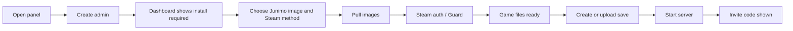

# Frontend UI / Interaction Refactor Plan

Date: 2026-06-27

This document is the implementation handoff for the post-MVP frontend redesign of `stardew-server-anxi-panel`. It assumes the MVP feature set is complete and focuses on user logic, UI hierarchy, interaction quality, and a phased path that does not break the current Go + React + GameDriver architecture.

## Product Position

The product is not a generic admin template. It is a local operations panel for a Stardew Valley dedicated server powered by JunimoServer. Users come here to answer a small set of urgent questions:

- Can my server run right now?
- What is blocking install/start?
- Which save will be used?
- What is the invite code?
- Did my last operation finish or fail?
- What should I do when Docker, Steam auth, a save, or a mod is wrong?

The redesign should keep the cozy farm identity, but the layout should behave like an operations console: dense, predictable, fast to scan, and hard to misuse.

## Current UX Diagnosis

### 1. Main screen is feature-complete but not task-shaped

Current layout is mostly a vertical composition of feature sections:

```text
user/status
install
lifecycle
saves
mods
console
jobs
advanced
```

This proves features exist, but it does not match how users think during operation. A user first needs server readiness, next action, active save, invite code, latest job, and only then deeper management.

Refactor target:

```text
left navigation
top command/status bar
primary task surface
right activity/health rail
secondary tabs for saves/mods/console/settings
```

### 2. "Start server" and "save required" are too far apart

The current start button lives in `LifecycleSection`, while the reason start may fail often lives in `SavesSection`. The code scrolls to saves after errors, which is useful, but the UI still teaches users to click first and understand second.

Refactor target:

- Show `Active save` in the same visual group as `Start`.
- When no active save exists, replace the primary start action with two clear actions: `Create save and start` and `Upload save and start`.
- Treat save selection as a preflight item, not a separate maintenance task.

### 3. Install flow is accurate but visually heavy

`InstallSection` handles many true states: pull, Steam auth method, Guard, QR, game download, SDK download, retry. The current UI exposes raw phases and several progress cards, which is valuable for debugging but heavy for first-time users.

Refactor target:

- Split install into a focused wizard surface:
  - Step 1: Credentials and version.
  - Step 2: Image pull.
  - Step 3: Steam auth.
  - Step 4: Game files ready.
- Keep full logs in the job rail.
- Show only the current decision or wait state in the wizard.

### 4. Jobs are important but currently over-present

The Jobs section is always prominent. During normal running, users only need the latest operation status and a path to inspect details.

Refactor target:

- Right rail shows latest job timeline and health badges.
- Full jobs list becomes a tab or drawer.
- Failed job state should promote a one-click recovery path if one exists.

### 5. Advanced area mixes unrelated maintenance

Docker status, user management, health diagnostics, support bundle, and audit logs are all under one collapsible advanced region. That hides useful troubleshooting tools and makes admin/security tasks compete with runtime diagnostics.

Refactor target:

- `Troubleshoot`: health diagnostics, Docker/Compose status, support bundle, recent failed jobs.
- `Security`: users, audit logs, session-related actions.
- Keep both admin-only.

### 6. Visual style is memorable but too chunky for repeated operations

The current chunky borders, large heading, heavy shadows, and large radii create a playful first impression, but repeated daily management benefits from tighter density and quieter surfaces.

Refactor target:

- Keep the farm/wood/parchment identity.
- Reduce global border thickness and giant shadows.
- Use 8px radius for standard controls and cards.
- Keep strong pixel/farm accents in navigation, status badges, and illustrations, not every container.

## Target User Journeys

### Journey A: First-time install



Primary UI rule: one current decision at a time. Do not show the full management dashboard as the user's main mental model until install is complete.

### Journey B: Daily start

```text
Open panel -> see current state -> confirm active save -> Start -> watch latest job -> copy invite code
```

Required first viewport:

- Server state.
- Active save.
- Primary lifecycle action.
- Invite code if running.
- Latest job result.
- Health summary.

### Journey C: Save maintenance

```text
Open Saves tab -> compare save metadata -> set active save or select-and-start -> export/delete/restore if needed
```

Required changes:

- Saves list should be table-like on desktop.
- Active save is pinned at top.
- Delete is not shown as equal weight to start/export.
- Backup and restore should be visible in the same tab now that backend exists.

### Journey D: Mod maintenance

```text
Open Mods tab -> upload/export/delete -> see restart-required banner -> restart server when safe
```

Required changes:

- Mod list should group by status: OK, parse error, restart required.
- Running server state should explain why upload/delete is disabled.
- Export all mods should be a maintenance action, not primary.

### Journey E: Troubleshooting

```text
Problem appears -> right rail says what failed -> open Troubleshoot -> run diagnostics -> export support bundle
```

Required changes:

- Failed job, health error, and Docker error must point to one shared Troubleshoot surface.
- Support bundle should sit next to diagnostics.
- Diagnostic checks should use plain action text, not only status colors.

## Proposed Information Architecture

### Single Game Mode Shell

Single Game Mode remains the default. Do not introduce a visible game list yet.

```text
AppShell
  LeftNav
  TopStatusBar
  MainRoute
  RightOpsRail
```

Suggested routes can remain internal until React Router is introduced:

```text
/                     -> Stardew overview
/instances/stardew    -> Stardew overview
/instances/stardew/install
/instances/stardew/saves
/instances/stardew/mods
/instances/stardew/console
/instances/stardew/troubleshoot
/settings/security
```

### Navigation

Left navigation should be stable and role-aware:

| Nav item | Role | Purpose |
| --- | --- | --- |
| Overview | all | state, primary actions, invite code, active save |
| Install | admin | first-time setup and retry path |
| Saves | all read, admin write | save list, active save, upload/create/export/restore |
| Mods | all read, admin write | mod list, upload/delete/export, restart banner |
| Console | all limited, admin full | allowlisted commands and output |
| Troubleshoot | admin | diagnostics, Docker/Compose, support bundle, failed jobs |
| Security | admin | users and audit logs |

## Target Screen Layouts

### 1. Overview / Daily Operations

Desktop structure:

```text
┌ Left nav ┬ Top command/status bar ─────────────────────────────┐
│          ├ Main operations panel ┬ Right ops rail              │
│          │ - lifecycle action    │ - latest job                │
│          │ - active save         │ - health summary            │
│          │ - invite code         │ - recent activity           │
│          │ - quick commands      │                             │
│          └ secondary cards: saves/mods restart hints           │
└────────────────────────────────────────────────────────────────┘
```

Interaction rules:

- If `running`: primary action is `Copy invite code`; lifecycle actions become secondary.
- If `stopped` and active save exists: primary action is `Start server`.
- If no active save: primary action group becomes `Create save and start` / `Upload save and start`.
- If `starting`: show job progress and disable destructive actions.
- If `error`: primary action becomes `Open Troubleshoot`.

### 2. Install Wizard

Four steps:

1. `Prepare`: Junimo directory and image version.
2. `Pull`: Docker image pull progress.
3. `Steam`: login method, Guard, QR/code/mobile approval.
4. `Ready`: game files ready, next save step.

Interaction rules:

- Hide raw `driverPhase` by default; show it under "technical details".
- If QR auth fails, explicitly offer `Use account/password path`.
- If credentials fail, reopen credentials step with previous username retained and password cleared unless backend supports safe reuse.
- Job log is available in the right rail, not mixed into each step.

### 3. Saves

Desktop table columns:

```text
Status | Save | Farm | Farmer | Time | Map | Size | Modified | Actions
```

Interaction rules:

- Active save row is pinned or visually fixed at top.
- `Select and start` is visible only when server is stopped.
- `Delete` is in an overflow menu or low-emphasis danger action.
- Restore backups should be in a "Backups" subpanel on the same page.

### 4. Mods

Desktop structure:

```text
Restart-required banner
Toolbar: Upload, Export all, Refresh
Mod table/grid with status chips
```

Interaction rules:

- Running server disables upload/delete and explains why.
- Parse errors should be searchable/filterable.
- Restart banner links back to Overview lifecycle action.

### 5. Console

Recommended layout:

```text
Command palette buttons
Output history
Optional raw log drawer
```

Interaction rules:

- Non-admin users see only `info` and `invitecode`.
- Admin commands are grouped: Info, Settings, Host, Rendering.
- `say` remains visually disabled or hidden until backend confirms a real command.

### 6. Troubleshoot

Include:

- Health diagnostics.
- Docker daemon / Compose status.
- Compose ps.
- Latest failed job.
- Support bundle export.
- Links to relevant handoff known issues.

Interaction rules:

- Diagnostics should produce actionable next steps.
- Support bundle export should stay admin-only.
- Do not surface sensitive values from `.env`, logs, invite codes, sessions, or tokens.

## Visual System

### Direction

"Operational farm console": cozy but structured.

Keep:

- Wood rail / parchment surfaces.
- Pixel-farm accents.
- Green success, gold warning, sky info, red danger.
- Stardew-specific mental model.

Reduce:

- Huge title after login.
- 4-8px borders everywhere.
- Large decorative shadows on every section.
- Purple-only Mod area that feels from another product.
- Nested cards.

### Tokens

```text
background.sky      #eaf6f7
background.grass    #dfeecf
surface.paper       #fff3cf
surface.paperSoft   #fff8e6
surface.wood        #7b4a26
surface.woodDark    #4b2816
text.strong         #2f1d12
text.muted          #73583f
accent.green        #3f8f3d
accent.sky          #287da8
accent.gold         #d99a24
accent.red          #b54837
border.default      #8f6a3f
border.strong       #4b2816
radius.control      8px
radius.panel        8px
shadow.raised       0 2px 0 rgba(75,40,22,.35)
```

### Typography

- Use system UI stack for all UI text.
- Use monospace only for IDs, invite codes, logs, commit hashes, and save folder names.
- Dashboard H1 should be small after login: 20-24px, not hero-scale.
- Section headings: 16-18px.
- Labels/captions: 12-13px.

### Components

| Component | Purpose | Notes |
| --- | --- | --- |
| `AppShell` | overall layout | left nav, top bar, content, right rail |
| `TopStatusBar` | global runtime status | state, active save, version, user |
| `OpsRail` | latest job + health | always visible on desktop |
| `PrimaryActionPanel` | lifecycle preflight | start/stop/restart/invite code |
| `PreflightChecklist` | blockers | install/save/Docker/active save |
| `InstallWizard` | first-time setup | wraps existing `InstallSection` logic |
| `DataTable` | saves, users, audit | replaces repeated custom grids |
| `MaintenanceToolbar` | refresh/upload/export | consistent button grouping |
| `DangerMenu` | delete/destructive | keeps primary tasks clean |
| `TroubleshootPanel` | diagnostics | combines health/Docker/support |

## Interaction Logic Rules

### Button priority

Only one visually primary action per surface.

Examples:

- Running: `Copy invite code`.
- Stopped with active save: `Start server`.
- Save missing: `Create save and start`.
- Install failed: `Retry install`.
- Health error: `Open troubleshoot`.

### Disabled controls

Every disabled control must have one of:

- inline reason text,
- tooltip,
- or a visible preflight checklist item.

Examples:

- "服务器运行中，上传 Mod 需要先停止服务器。"
- "没有已选择的启动存档。"
- "只有管理员可以导出诊断包。"

### Confirmation

Replace `window.confirm` for destructive actions with a reusable modal:

- show object name,
- show automatic backup note if applicable,
- require explicit final click.

Do not block on browser-native confirm for core flows.

### Loading and polling

- `starting` and install states should pin progress in the right rail.
- Long jobs should keep the current page usable where safe.
- Failed jobs should include `Retry`, `View logs`, `Export support bundle` when applicable.

## Implementation Plan

### Phase UI-1: Shell and Overview

Goal: change information architecture without touching backend APIs.

Files likely touched:

- `frontend/src/App.tsx`
- `frontend/src/App.css`
- new `frontend/src/core/AppShell.tsx`
- new `frontend/src/core/LeftNav.tsx`
- new `frontend/src/core/TopStatusBar.tsx`
- new `frontend/src/games/stardew/OverviewPage.tsx`
- new `frontend/src/games/stardew/OpsRail.tsx`

Acceptance:

- Login/setup still work.
- Dashboard first viewport shows server state, active save, primary action, latest job, health summary.
- Existing Install/Saves/Mods/Console components can still be reached.
- `npm run build` passes.

### Phase UI-2: Install Wizard Refactor

Goal: turn `InstallSection` into a wizard while preserving state handling.

Files likely touched:

- `InstallSection.tsx`
- `install-helpers.ts`
- `JobsSection.tsx`

Acceptance:

- All current phases remain handled.
- QR, Guard code, mobile approval, retry paths still work.
- Raw job logs move to rail/details.
- Error messages become action-oriented.

### Phase UI-3: Saves / Mods / Console Pages

Goal: improve daily maintenance density and safety.

Files likely touched:

- `SavesSection.tsx`
- `ModsSection.tsx`
- `ConsoleSection.tsx`
- shared `DataTable`, `Toolbar`, `ConfirmDialog`

Acceptance:

- Saves support active pinned row and backup/restore visibility.
- Running-state restrictions are clear.
- Console command groups match role permissions.
- Native `window.confirm` removed from delete/stop/restart flows.

### Phase UI-4: Troubleshoot and Security Split

Goal: make diagnostics and admin/security tools discoverable.

Files likely touched:

- current advanced region in `App.tsx`
- `DockerSection.tsx`
- new `TroubleshootPage.tsx`
- new `SecurityPage.tsx`

Acceptance:

- Health, Docker, support bundle, failed jobs share one troubleshoot page.
- Users and audit logs move to security page.
- Non-admin users do not see admin-only entries.

### Phase UI-5: Visual Polish and Responsive QA

Goal: normalize tokens, spacing, mobile behavior, and accessibility.

Acceptance:

- No horizontal overflow at 360px width.
- Text does not clip in buttons, badges, tables, mod/save rows.
- Keyboard focus is visible.
- Color contrast passes practical reading checks.
- Desktop and mobile screenshots match the new prototype direction.

## API / Backend Impact

The first refactor phases should not require backend changes. The UI can consume existing endpoints:

```text
GET /api/instances/:id/state
POST /api/instances/:id/start
POST /api/instances/:id/stop
POST /api/instances/:id/restart
GET /api/instances/:id/saves
GET /api/instances/:id/mods
GET /api/jobs
GET /api/health/diagnostics
POST /api/instances/:id/support-bundle
GET /api/audit-logs
```

Useful future backend improvements:

- Add a compact "dashboard summary" endpoint that returns state, active save, latest job, health summary, and restart-required flags in one request.
- Add audit log filters.
- Add backup list into saves summary or expose richer backup metadata.
- Add command output markers if console output remains noisy.

## Prototype

See:

- `docs/prototypes/stardew-anxi-panel-ui-refactor-prototype.html`
- `docs/prototypes/stardew-anxi-panel-ui-refactor-notes.md`

The prototype is intentionally not a final visual skin. It is a product blueprint showing layout hierarchy, state priority, and the redesigned navigation model.

## Validation Checklist

Before merging the actual UI refactor:

- [ ] First-time admin setup still works.
- [ ] Login/logout still works.
- [ ] Admin and normal user navigation differ correctly.
- [ ] Install flow handles pull, Steam auth method, Guard code, mobile approval, QR failure, timeout, and retry.
- [ ] Start button cannot lead users into an unexplained save-required failure.
- [ ] Active save is visible before start.
- [ ] Running state disables dangerous save/mod writes with clear reasons.
- [ ] Latest job and failed job are visible without opening a log page.
- [ ] Health diagnostics and support bundle are discoverable.
- [ ] Destructive actions use a custom confirm dialog.
- [ ] Desktop, tablet, and mobile layouts are checked.
- [ ] `npm run build` passes.
- [ ] Existing `go test ./...` remains green if any API behavior changes.

