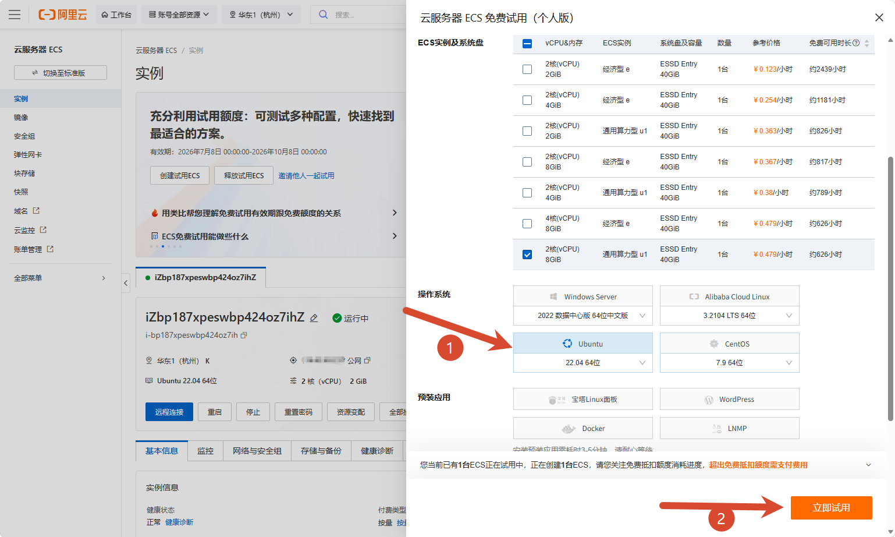
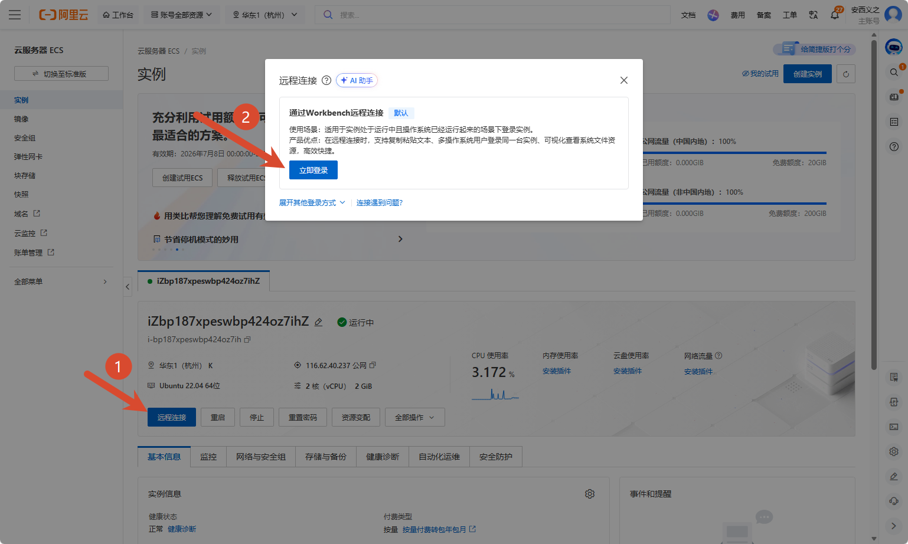
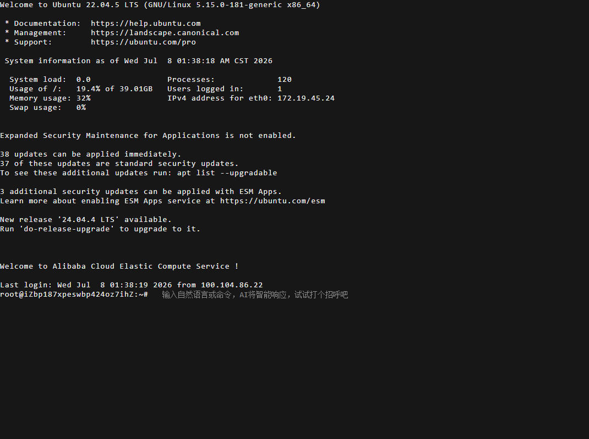

# 服务器选择

## 部署前确认

- 一台 Linux 服务器（云服务器）或支持 Docker 的 NAS（飞牛、群晖、绿联、威联通等）。
- 已安装 Docker Engine 24+ 和 Docker Compose V2（或使用 NAS 自带的 Docker / Container Manager 应用）。
- 最低 2 核 2 GB 内存、20 GB 可用磁盘；推荐 2 核 4 GB 以上。详细配置建议见 [系统要求](/deploy/requirements)。

  大型 Mod 会有更多 CPU 与内存消耗，且注意：星露谷是单核游戏，一个世界只用一个 CPU 核心，核心数再多也用不上；想要流畅的游戏体验，关键是更高主频的 CPU，其次才是内存大小。

- 云服务器需要能开放公网端口；NAS 家用场景至少要能在局域网访问。

## 没有云服务器？先领取阿里云免费试用

如果你手头没有云服务器，可以用阿里云的个人免费试用额度先跑起来，全程不用买服务器：

1. 打开 [阿里云 ECS 免费试用（个人版）](https://free.aliyun.com/?product=1351&crowd)，用支付宝/淘宝账号登录并完成个人实名认证。页面默认勾选"个人认证"和"云服务器"分类，能看到"云服务器 ECS 免费试用（个人版）"卡片：3 个月内有效，免费抵扣总额度 300 元，超出免费额度部分才需要自己付费。点击"立即试用"。

2. 在弹出的配置面板里：
   - **ECS 实例规格**：按人数需求勾选，参考 [系统要求](/deploy/requirements) 的多人游玩推荐配置——自己玩或 1-2 人选 `2 核 2GiB`，3-4 人选 `2 核 4GiB`，人更多或 Mod 较多选 `4 核 8GiB`。
   - **操作系统**选 `Ubuntu`，版本选 `22.04 64位`。
   - **预装应用**勾选 `Docker`（预装好之后一键脚本会自动检测到已有 Docker，跳过安装步骤；装好应用需要等 3-5 分钟）。
   - 勾选底部服务协议后点击**立即试用**。

   

   ::: tip 提示里的"ICP 备案"跟你没关系
   试用页面会提示"当前试用 ECS 为按量付费实例，不满足国内 ICP 备案要求"——这个提示只影响想用域名对外提供网站访问的场景。星露谷服务器走 IP 直连或 Steam 邀请码加入，不需要备案，可以忽略这条提示。
   :::

3. 等实例创建完成、状态变成"运行中"后，点实例卡片上的**远程连接**，在弹出的"通过 Workbench 远程连接"面板里点**立即登录**。

   

4. 浏览器会打开一个终端窗口，看到 Ubuntu 的欢迎信息和 `root@...:~#` 命令提示符，这就是你的服务器终端了，可以直接在这里执行下一节的一键部署命令。

   

::: warning 免费试用到期后
免费额度 3 个月内有效，每小时抵扣有上限；到期或超额后会按量计费，如果不想继续使用记得到实例列表里手动释放实例，避免产生费用。
:::

## 下一步

服务器准备好了，接下来跑一键部署脚本：看 [部署安装](/guide/deploy)。
