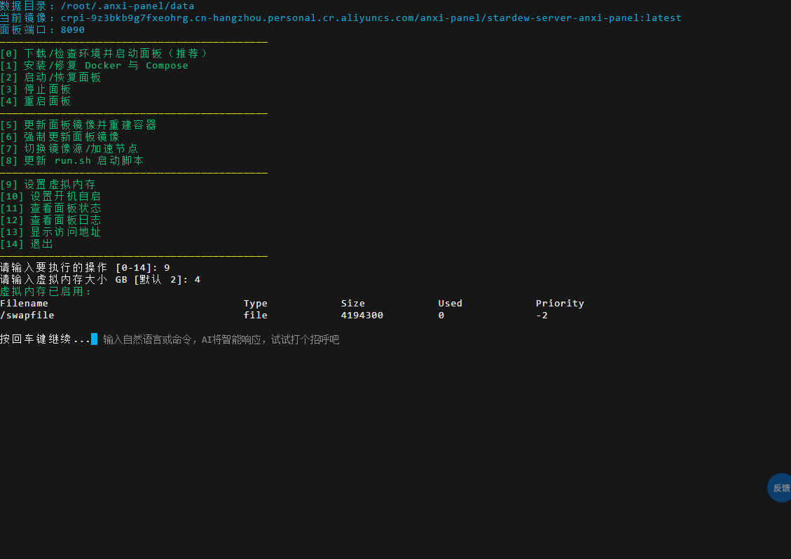
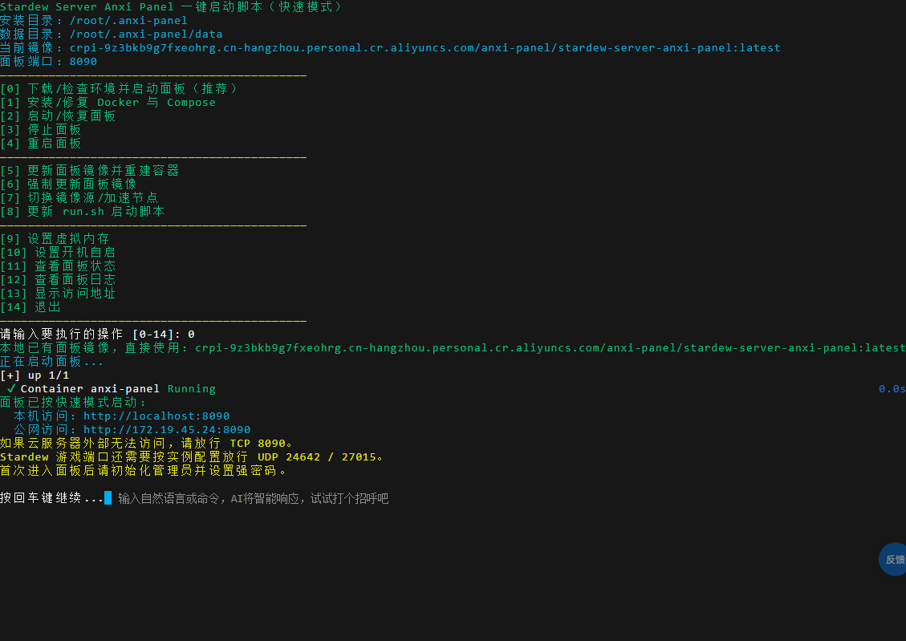
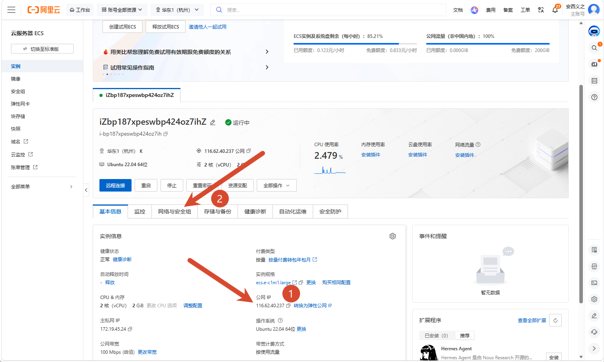
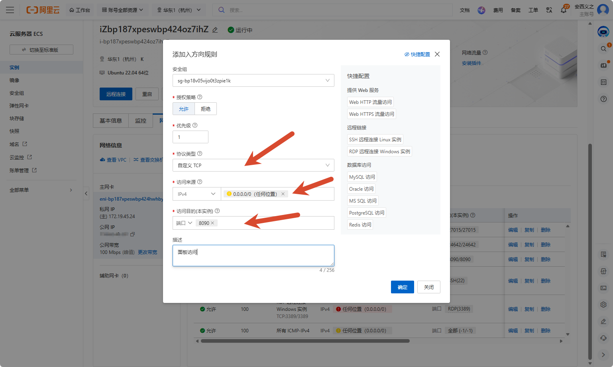

# 部署面板

选一种安装入口，完成后回到这里继续首次配置。Linux 云服务器优先使用一键脚本；NAS 用户直接看 [NAS 图形化部署](/deploy/nas)。

## 开始前确认

- 已经进入服务器的 Linux 终端，并且当前账号可以使用 `sudo` 或本身就是 `root`。
- 服务器至少有 2 核 CPU、2 GB 内存和 20 GB 可用磁盘；小内存机器稍后先设置 swap。
- 云服务器控制台允许你添加安全组规则。
- Windows 用户要在已经启用 Docker Desktop 集成的 **WSL2 Linux 终端**运行脚本，不能直接在 PowerShell 里执行。完整条件见 [系统要求](/deploy/requirements#windows-docker-desktop)。

## 选择一个安装入口

下面两种方式都会下载同一份 `run.sh`，后续菜单和部署流程完全相同。根据服务器当前能稳定访问的链路选择其一即可。

### 国内服务器：HTTP 加速脚本

```bash
curl -fsSL -o run.sh http://anxinas.dpdns.org/run.sh && chmod +x run.sh && bash run.sh
```

### GitHub Release：HTTPS 加速连接

海外服务器，或国内入口当前不可用时使用：

```bash
curl -fsSL -o run.sh https://github.com/anxiyizhi/stardew-server-anxi-panel/releases/latest/download/run.sh && chmod +x run.sh && bash run.sh
```

## 首次部署只做两件事

脚本打开菜单后，内存较小的服务器先设置虚拟内存，再执行推荐安装。

### 1. 输入 `9` 设置 swap

建议给 2 GB 内存的服务器设置 2–4 GB swap，避免安装或运行过程中因为内存不足被系统杀掉进程：



设置完成后按回车回到菜单。

### 2. 输入 `0` 安装并启动面板

- 如果服务器还没装 Docker，脚本会提示“安装/修复 Docker”，输入 `y` 回车。
- 如果提示选择镜像源，直接回车使用默认选项 `1`（国内最快）。
- 安装完成后，脚本会启动面板容器并显示访问地址。



<details>
<summary>查看 run.sh 完整菜单</summary>

```text
[0] 下载/检查环境并启动面板（推荐）
[1] 安装/修复 Docker 与 Compose
[2] 启动/恢复面板
[3] 停止面板
[4] 重启面板
[5] 更新面板镜像并重建容器
[6] 强制更新面板镜像
[7] 切换镜像源/加速节点
[8] 更新 run.sh 启动脚本
[9] 设置虚拟内存
[10] 设置开机自启
[11] 查看面板状态
[12] 查看面板日志
[13] 显示访问地址
[14] 退出
```

</details>

更新、强制更新和镜像源切换等完整说明见 [run.sh 命令参考](/deploy/quick-start)。

## 打开访问端口

必须放行：

```text
TCP 8090      面板访问
UDP 24642     Stardew 游戏端口
UDP 27015     查询端口
```

按需放行 `TCP 5800`（只有需要在浏览器查看游戏画面时才用）。完整说明见 [端口与安全组](/deploy/ports)。

::: warning 脚本显示的“公网访问”地址不一定准确
脚本探测到的地址有时是 `172.x.x.x` 一类内网 IP。请以云服务器控制台“实例详情”里显示的公网 IP 为准。


:::

如果 `http://公网IP:8090` 打不开，在云服务器安全组添加入方向规则：协议选“自定义 TCP”，来源选 `0.0.0.0/0`，端口填 `8090`。



## 部署完成后

打开 `http://公网IP:8090`，立即创建自己的管理员账号并设置强密码。接着按 [首次进入面板](/guide/first-login) 完成游戏安装、存档创建或导入，再启动并邀请朋友。

- 使用 NAS：看 [NAS 图形化部署](/deploy/nas)。
- 面板或容器起不来：看 [常见问题](/faq/)。
