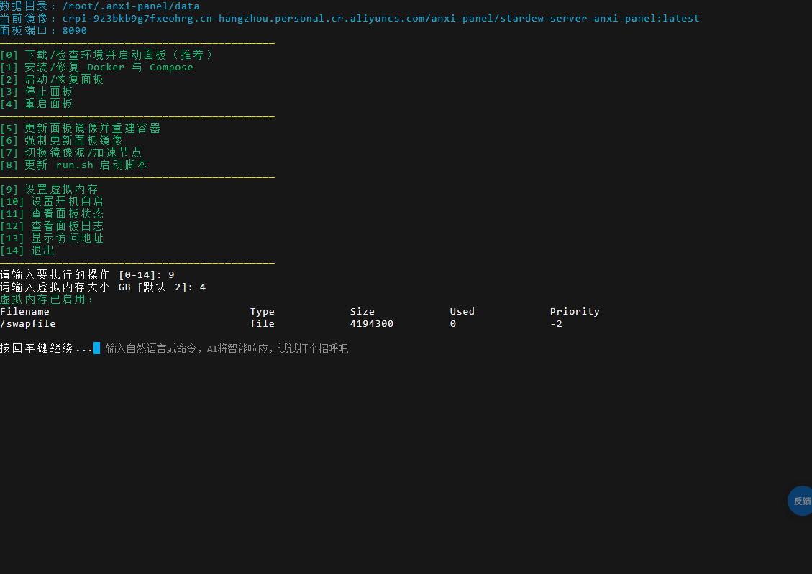
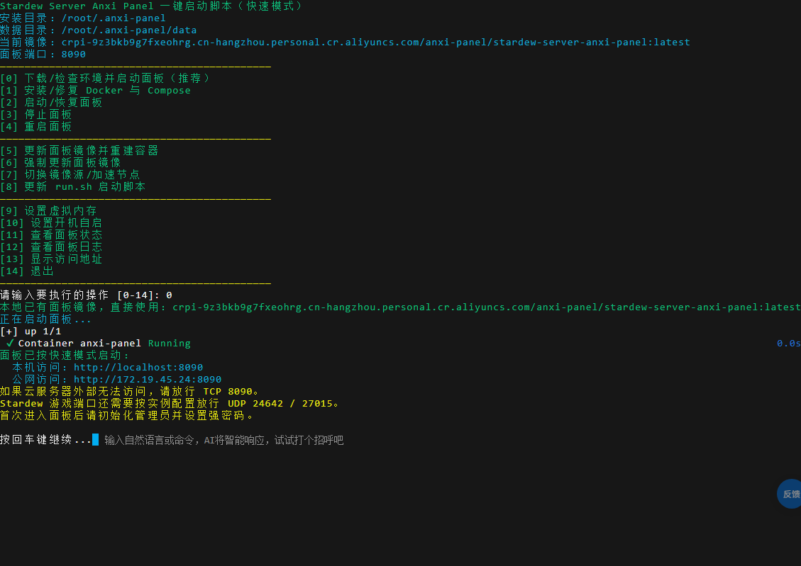
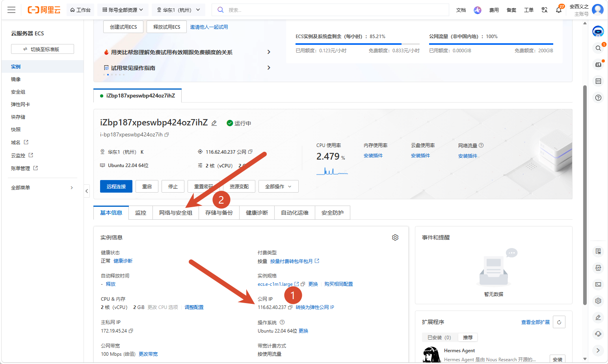
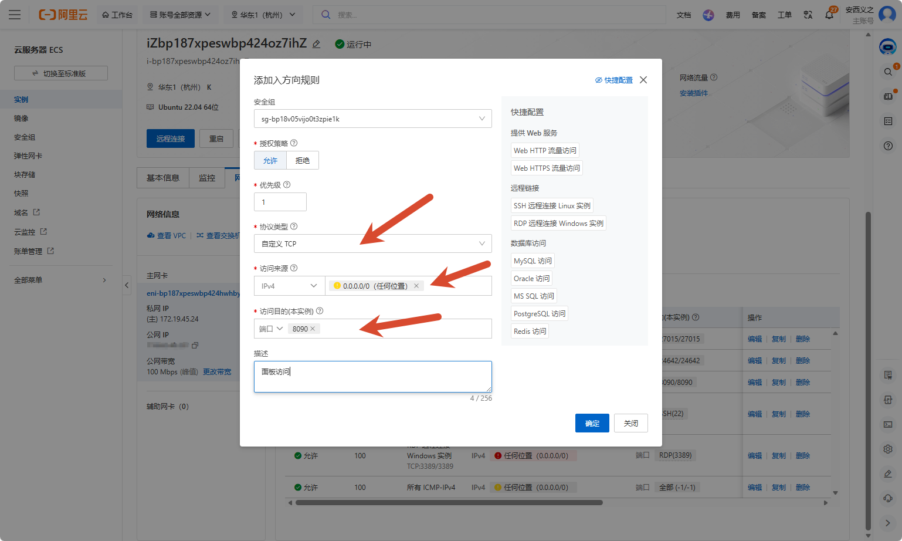

# 快速开始

`Anxi Panel` 是围绕 [JunimoServer](https://stardew-valley-dedicated-server.github.io/server/) 构建的星露谷物语（Stardew Valley）专用服务器 Web 管理面板。

如果你只是想把星露谷物语服务器部署到一台云服务器或 NAS 上，不需要看源码、不需要懂 Docker 细节，跟着本页和后面几页操作即可。

## 这个面板能做什么

运行一个 Docker 镜像，打开浏览器就能：

- 创建管理员账号并登录。
- 一键安装 Stardew 服务器（自动完成 Steam 认证）。
- 新建或上传自己的正式农场存档。
- 启动 / 停止 / 重启服务器，查看邀请码和局域网直连地址。
- 管理存档备份、Mod、控制台命令和面板用户。

## 部署前确认

- 一台 Linux 服务器（云服务器）或支持 Docker 的 NAS（飞牛、群晖、绿联、威联通等）。
- 已安装 Docker Engine 24+ 和 Docker Compose V2（或使用 NAS 自带的 Docker / Container Manager 应用）。
- 最低 2 核 2 GB 内存、20 GB 可用磁盘；推荐 2 核 4 GB 以上。详细配置建议见 [系统要求](/deploy/requirements)。

  大型 Mod 会有更多 CPU 与内存消耗，且注意：星露谷是单核游戏，一个世界只用一个 CPU 核心，核心数再多也用不上；想要流畅的游戏体验，关键是更高主频的 CPU，其次才是内存大小。

- 云服务器需要能开放公网端口；NAS 家用场景至少要能在局域网访问。

## 没有云服务器？先领取阿里云免费试用

如果你手头没有云服务器，可以用阿里云的个人免费试用额度先跑起来，全程不用买服务器：

1. 打开 [阿里云 ECS 免费试用（个人版）](https://free.aliyun.com/?product=1351&crowd)，用支付宝/淘宝账号登录并完成个人实名认证。页面默认勾选"个人认证"和"云服务器"分类，能看到"云服务器 ECS 免费试用（个人版）"卡片：3 个月内有效，免费抵扣总额度 300 元，超出免费额度部分才需要自己付费。点击"立即试用"。

2. 在弹出的配置面板里：
   - **ECS 实例规格**：按人数需求勾选，参考 [系统要求](/deploy/requirements) 的多人游玩推荐配置——自己玩或 1-2 人选 `2 核 2GiB`，3-4 人选 `2 核 4GiB`，人更多或 Mod 较多选 `4 核 8GiB`。
   - **操作系统**选 `Ubuntu`，版本选 `22.04 64位`。
   - **预装应用**勾选 `Docker`（预装好之后一键脚本会自动检测到已有 Docker，跳过安装步骤；装好应用需要等 3-5 分钟）。
   - 勾选底部服务协议后点击**立即试用**。

   

   ::: tip 提示里的"ICP 备案"跟你没关系
   试用页面会提示"当前试用 ECS 为按量付费实例，不满足国内 ICP 备案要求"——这个提示只影响想用域名对外提供网站访问的场景。星露谷服务器走 IP 直连或 Steam 邀请码加入，不需要备案，可以忽略这条提示。
   :::

3. 等实例创建完成、状态变成"运行中"后，点实例卡片上的**远程连接**，在弹出的"通过 Workbench 远程连接"面板里点**立即登录**。

   

4. 浏览器会打开一个终端窗口，看到 Ubuntu 的欢迎信息和 `root@...:~#` 命令提示符，这就是你的服务器终端了，可以直接在这里执行下一节的一键部署命令。

   

::: warning 免费试用到期后
免费额度 3 个月内有效，每小时抵扣有上限；到期或超额后会按量计费，如果不想继续使用记得到实例列表里手动释放实例，避免产生费用。
:::

## 一键部署（Linux 云服务器推荐）

国内加速安装：

```bash
curl -fsSL -o run.sh http://anxinas.dpdns.org/run.sh && chmod +x run.sh && bash run.sh
```

GitHub Release 安装（海外服务器或国内加速不可用时）：

```bash
curl -fsSL -o run.sh https://github.com/anxiyizhi/stardew-server-anxi-panel/releases/latest/download/run.sh && chmod +x run.sh && bash run.sh
```

运行后会出现菜单：

```text
[0] 下载/检查环境并启动面板（推荐）
[1] 安装/修复 Docker 与 Compose
[2] 启动/恢复面板
[3] 停止面板
[4] 重启面板
[5] 更新面板镜像并重建容器
[6] 强制更新面板镜像
[7] 切换镜像源/加速节点
[8] 更新 run.sh 启动脚本
[9] 设置虚拟内存
[10] 设置开机自启
[11] 查看面板状态
[12] 查看面板日志
[13] 显示访问地址
[14] 退出
```

建议先输入 `9` 回车，给内存较小的服务器开一个 2-4 GB 的 swap 虚拟内存，避免安装或运行过程中因为内存不够被系统杀掉进程：



设置完成按回车键回到菜单，再输入 `0` 回车，开始下载/检查环境并启动面板：

- 如果服务器还没装 Docker，会提示"安装/修复 Docker"，输入 `y` 回车即可，脚本会自动安装 Docker 和 Compose。
- 如果安装过程中提示选择镜像源，直接回车用默认选项 `1`（国内最快）即可。
- 安装完成后会自动启动容器，显示访问地址和端口提醒：



::: warning 脚本显示的"公网访问"地址不一定准
脚本探测到的公网地址有时其实是内网 IP（比如 `172.x.x.x`），打不开是正常的。以云服务器控制台"实例详情"页显示的公网 IP 为准：


:::

用控制台显示的真实公网 IP 打开 `http://公网IP:8090`。如果打不开，去实例详情页的"网络与安全组"标签，添加入方向规则放行需要的端口（协议类型选"自定义 TCP"，访问来源选 `0.0.0.0/0`，端口填 `8090`）：



必须放行：

```text
TCP 8090      面板访问
UDP 24642     Stardew 游戏端口
UDP 27015     查询端口
```

按需放行 `TCP 5800`（VNC/noVNC，浏览器看游戏画面才需要）。完整端口说明见 [端口与安全组](/deploy/ports)。

打开 `http://公网IP:8090` 后，尽快注册自己的管理员账号并设置强密码。

更完整的一键脚本用法（更新、强制更新、镜像源切换等）见 [一键脚本部署](/deploy/quick-start)。NAS 用户请看 [NAS 图形化部署](/deploy/nas)。

## 下一步

- 打开面板后要做什么：看 [首次进入面板](/guide/first-login)。
- 部署遇到问题：看 [常见问题](/faq/)。
